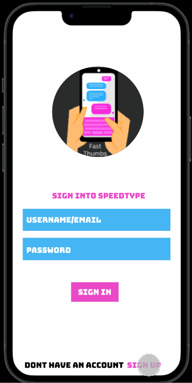

# FastThumbs
Original App Design Project - README Template
===

# FastThumbs

## Table of Contents
1. [Overview](#Overview)
1. [Product Spec](#Product-Spec)
1. [Wireframes](#Wireframes)
2. [Schema](#Schema)

## Overview
### Description
Game app that scores how fast users can type.

### App Evaluation
[Evaluation of your app across the following attributes]
- **Category:** Gaming/Skill Learning
- **Mobile:** We want this application exclusively for mobile devices as our purpose is to improve users mobile texting skills. Functionality would not be limited to just mobile devices but on principal it is best to keep it mobile for the sake of being unique.
- **Story:** App helps build user mobile typing skills by giving timed prompts. Users can be competitive with one another with global leaderboards.
- **Market:** Our market is for those who want to improve mobile typing skills and competitive natured players.
- **Habit:** This app is encouraged to be used daily because of daily challenges and building skills incrementally.
- **Scope:**First we would start with our app determining how fast and accurate they can type. We would also give users the option to select from a competitive or casual game and view a leaderboard. Our app can expand into either having teams of players competing against other teams (like Clash of Clans) or allow users to create their own prompts/levels that other players can try.

## Product Spec

### 1. User Stories (Required and Optional)

**Required Must-have Stories**

* User can register an account and login 
* User can select the category, text prompt and if they want casual or competitive and hit play
* Application determines the accuracy and speed at which the user is typing in game
* Users can go to settings and toggle dark mode and can delete their account and report a bug
* User can go to their profile, edit their profile picture, add bio, see past 3 games, and see accuracy & speed stats for both competitive and casual
* Leaderboard shows top 20 players & has infinite pagination. Each user card shows profile picture, username, competitive games played, score(speed & accuracy). User can click on someones name and profile picture and see their profile. 
* User completes prompts in portrait mode with keyboard on the bottom half and prompt on top half.
* Remove ability to copy and paste in the playing fragment.
* After a level was completed, user can share score, category, 

**Optional Nice-to-have Stories**

* Implementing friends that are associated with other users. Users can search up people’s full names, send them a friend request, and the person on the other end can accept the request.
* Giving the ability to play a random prompt the user did not select.
* Users can gain experience points per prompt completed and have a number level associated with them.
* Users can play in Landscape mode which could be separately scored.
* In settings, users can toggle notifications for daily challenge and turn off daily challenge appearing immediately after login


### 2. Screen Archetypes

* Login (Logo, Name of App) 
   * button to move to register
   * The user is able to sign back in automatically if they close out the application 

* Register 
   * Upon Download/Reopening of the application, the user is prompted to log in to gain access to their profile information

* Selection Screen
   * Upon logging in or Registering the user is shown the categories of the types of prompts. Also users can select if they are playing casual or competitive as a toggle button. 

* Gameplay Screen
    * User can type and see their progress and errors in real time. Theres a back button that directs the user back to the game selection screen
 
* Leaderboard
    * The user can see the top 20 scores of every player and click on a user profile which directs them to their profile

* Profile
    * The user can see their average competetive Acuracy and Speed. They can also see their number of points. If they scroll further down they can see the resukts of the last three games played. There is a button on the top right that takes the user to the settings page
    
* Settings
    * The user can change the app theme, toggle notifications, delete their account or report a bug

### 3. Navigation

**Tab Navigation** (Tab to Screen)

* Leaderboard
* Play Game
* Profile

**Flow Navigation** (Screen to Screen)

* Login 
   * Registration
   * Selection Screen (Home)
   
* Registration
   * Selection Screen (Home)
   * Login

* Selection Screen
   * Jumps to game

* Gameplay Screen
   * Keyboard
   * Results screen jumps to home

* Leaderboard
   * Jumps to profile

* Profile 
   * Text Fields to be modified
   * Jumps to settings

* Settings
   * Toggle settings
   * Button to report or delete account
  
## Wireframes
[Add picture of your hand sketched wireframes in this section]


### [BONUS] Digital Wireframes & Mockups


### [BONUS] Interactive Prototype



## Schema
[This section will be completed in Unit 9]
### Models
#### users

   | Property  	      | Type 	 | Description                                            |
   | -------------    | -------- | ------------                                           |
   | username	      | String   | Unique username for user (default field & autocreated) |
   | email	      | String   | Unique email for user for login                        |
   | password	      | String   | User password for login                                |
   | profilePicture   | File     | User profile image                                     |
   | bio	                 | String   | Profile caption from user                              |
   | totalPoints       | Number   | Cumulative points for games & daily challenges played  |
   | averageAccuracy  | Number   | Value for overall user accuracy (excludes casual mode) |
   | averageSpeed     | Number   | Value for overall user speed (excludes casual)         |
   | gamesPlayed      | Number   | Number of games user played                            |

#### gamesPlayedLog

   | Property | Type 	        | Description                                                    |
   | -------  | --------        | ------------                                                   |
   | username | Pointer to User | Unique id for user (default field & foreign key)               |
   | date          | Date            | Date & time of when user played game (autocreated by backend)  |
   | points       | Number          | Points played achieved from playing game                       |
   | accuracy  | Number          | Value for user accuracy                                        |
   | speed      | Number          | Value for user speed                                           |
   | category  | String             | Name of category user played                                   |
   | daily         | Boolean         | True if game played was the daily challenge                    |
   | competitive | Boolean      | True if game played was in competitive mode                    | 


   
### Networking
- [Add list of network requests by screen ]
- [Create basic snippets for each Parse network request]
- [OPTIONAL: List endpoints if using existing API such as Yelp]

List of network requests by screen

* Sign In Screen
   * (Read/GET) Check if login information exists and is accurate
```swift
ParseQuery<ParseObject> query = ParseQuery.getQuery("users");
query.getInBackground("---username-goes-here---", new GetCallback<ParseObject>() {
  public void done(ParseObject userObject, ParseException e) {
    if (e == null) {
      String username = userObject.getString("username");
      String email = userObject.getString("email");
      String password = userObject.getString("password");
      // TODO -> Compare login info & signin if match occurs
    } else {
      // something went wrong
    }
  }
});
```

* Register Screen
   * (Read/GET) Check if new user information is unique & (Create/POST) Register new user
```swift
ParseQuery<ParseObject> query = ParseQuery.getQuery("users");
query.getInBackground("---username-goes-here---", new GetCallback<ParseObject>() {
  public void done(ParseObject userObject, ParseException e) {
    if (e == null) {
        String username = userObject.getString("username");
        String email = userObject.getString("email");
        String password = userObject.getString("password");

        // TODO -> Check if login info already exists, if not then proceed to create new user
        
	ParseObject gamePlayedObject = new ParseObject("gamesPlayedLog");
	
	gamePlayedObject.put("username", "---var-goes-here---");
	gamePlayedObject.put("points", "---var-goes-here---");
	gamePlayedObject.put("Average Accuracy", "---var-goes-here---");
	gamePlayedObject.put("Average Speed", "---var-goes-here---");
	gamePlayedObject.put("category", "---var-goes-here---");
	gamePlayedObject.put("daily", "---var-goes-here---");
	gamePlayedObject.put("competitive", "---var-goes-here---");

	gamePlayedObject.saveInBackground();


      
    } else {
      // something went wrong
    }
  }
```

* Leaderboard
   * (Read/GET) Get all relevant user info to display top ten players
```swift
 ParseQuery<ParseObject> query = ParseQuery.getQuery("users");
query.getInBackground("---username-goes-here---", new GetCallback<ParseObject>() {
  public void done(ParseObject userObject, ParseException e) {
    if (e == null) {
      query.orderByDescending("totalPoints");
      query.setLimit(10);
    query.findInBackground(new FindCallback<ParseObject>() {
    public void done(List<ParseObject> topPlayersListObject, ParseException e) {
        if (e == null) {
            // Loop through top list object for top ten player info
            for (let i = 0; i < topPlayersListObject.length;i++) {
                String topPlayersListObject[i].get("username");
                String topPlayersListObject[i].get("profilePicture");
                int topPlayersListObject[i].get("totalPoints");
            }
        } else {
            // ERROR NEED TO HANDLE
        }
    }
});
```
* Other User Profile
   * (Read/GET) Get all user profile information to display
```swift
ParseQuery<ParseObject> query = ParseQuery.getQuery("users");
query.getInBackground("---username-goes-here---", new GetCallback<ParseObject>() {
  public void done(ParseObject userObject, ParseException e) {
    if (e == null) {
      String profilePicture = userObject.getString("Profile Picture");
      String bio = userObject.getString("Bio");
      int totalPoints = userObject.getInt("totalPoints")
      int averageAccuracy = userObject.getInt("averageAccuracy");
      int averageSpeed = userObject.getInt("averageSpeed");
      int gamesPlayed = userObject.getInt("Games Played")
      
      // query for last 3 played games
      
        ParseQuery<ParseObject> query = ParseQuery.getQuery("gamesPlayedLog");
        query.whereEqualTo("username", "---username-goes-here---");
        query.orderByDescending("Date");
        query.setLimit(3);
        query.findInBackground(new FindCallback<ParseObject>() {
        public void done(List<ParseObject> scoreList, ParseException e) {
        if (e == null) {
            // TODO -> Display last 3 played games
        } else {
            // ERROR NEED TO HANDLE
        }
    }
});
```


* Play Screen
   * (Read/GET) Get the prompt from API for user to type
	*** Don't have this API established yet ***

* Results Screen
   * (Create/POST) Create new entry in Games Played Log
```swift
	ParseObject gameLogObject = new ParseObject("gamesPlayedLog");
	gamesLogObject.put("username", "---var-goes-here---");
	// Date not here cause its autocreated
	gamesLogObject.put("points", "---var-goes-here---");
	gamesLogObject.put("accuracy", "---var-goes-here---");
	gamesLogObject.put("speed", "---var-goes-here---");
	gamesLogObject.put("category", "---var-goes-here---");
	gamesLogObject.put("daily", "---var-goes-here---");
	gamesLogObject.put("competitive", "---var-goes-here---");

	gamesLogObject.saveInBackground();
```

   * (Update/PUT) Update new user total score after game played & increment gamesPlayed by one
```swift
ParseQuery<ParseObject> query = ParseQuery.getQuery("users");
query.getInBackground("---username-goes-here---", new GetCallback<ParseObject>() {
  public void done(ParseObject userObject, ParseException e) {
    if (e == null) {
      int totalScore = userObject.getInt("totalPoints");
      // Game Logic not finalized, so lets say points earned from
      // game recently played is in variable "gamePoints"
      totalScore += gamePoints;
      userObject.put("totalPoints");
      userObject.increment(“gamesPlayed”);
      // Save update user score to backend here
      userObject.saveInBackground();
      
    } else {
      // something went wrong
    }
  }
});
```

	
* Personal Profile
   * (Read/GET) Get all user profile information to display
```swift
ParseQuery<ParseObject> query = ParseQuery.getQuery("users");
query.getInBackground("---username-goes-here---", new GetCallback<ParseObject>() {
  public void done(ParseObject userObject, ParseException e) {
    if (e == null) {
      String profilePicture = userObject.getString("Profile Picture");
      String bio = userObject.getString("Bio");
      int totalPoints = userObject.getInt("totalPoints")
      int averageAccuracy = userObject.getInt("averageAccuracy");
      int averageSpeed = userObject.getInt("averageSpeed");
      int gamesPlayed = userObject.getInt("Games Played")
      
      // query for last 3 played games
      
        ParseQuery<ParseObject> query = ParseQuery.getQuery("gamesPlayedLog");
        query.whereEqualTo("username", "---username-goes-here---");
        query.orderByDescending("Date");
        query.setLimit(3);
        query.findInBackground(new FindCallback<ParseObject>() {
        public void done(List<ParseObject> scoreList, ParseException e) {
        if (e == null) {
            // TODO -> Display last 3 played games
        } else {
            // ERROR NEED TO HANDLE
        }
    }
});
```


   * (Update/PUT) Change personal profile picture
```swift
ParseQuery<ParseObject> query = ParseQuery.getQuery("users");
query.getInBackground("---username-goes-here---", new GetCallback<ParseObject>() {
  public void done(ParseObject userObject, ParseException e) {
    if (e == null) {
      //For example say variable "newProfilePicture" is new pfp file variable
      userObject.put("profilePicture", newProfilePicture);
      userObject.saveInBackground();
      
    } else {
      // something went wrong
    }
  }
});
```

   * (Update/PUT) Change personal bio
```swift
ParseQuery<ParseObject> query = ParseQuery.getQuery("users");
query.getInBackground("---username-goes-here---", new GetCallback<ParseObject>() {
  public void done(ParseObject userObject, ParseException e) {
    if (e == null) {
      //For example say variable "newBio" is new bio variable
      userObject.put("bio", newBio);
      userObject.saveInBackground();
      
    } else {
      // something went wrong
    }
  }
});
```


* Settings
   * (Delete) Delete user profile and all their games played
```swift
ParseQuery<ParseObject> query = ParseQuery.getQuery("users");
query.whereEqualTo("username", "---username-goes-here---");
query.findInBackground(new FindCallback<ParseObject>() {
    public void done(List<ParseObject> userObject, ParseException e) {
        if (e == null) {
            userObject.deleteInBackground;
        } else {
            // ERROR, NEED TO HANDLE
        }
    }
});
```
 
## Fast_Thumbs GIF SPRINT 1


GIF created with [LiceCap](http://www.cockos.com/licecap/).


